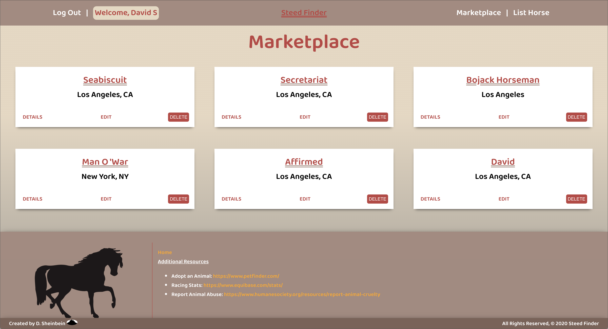

# **Stead Finder**

This website showcase RESTful routes, CRUD functionality, and JWT login requirements. A variety of technologies were used and are listed below.

The websites allow people to post horses and their contact information in the hopes of connecting sellers with potential buyers.

You are able to list a horse and leave comments on horses when logged into the website.

## Screenshot:

### Home Page Sceenshot

[Home Page Sceenshot](https://imgur.com/6bHIxvp)

[List Horse Sceenshot](https://imgur.com/N3tfSTH)

[Horse Marketplace Sceenshot](https://imgur.com/3dEGVu0)

[Not Logged in Page Sceenshot](https://imgur.com/SCts7Fl)

[Login Sceenshot](https://imgur.com/lKojeae)

[Signup Sceenshot](https://imgur.com/rGSg1pQ)

## Technologies Used: 

#### 1. HTML5
#### 2. CSS
#### 3. JavaScript
#### 4. Mongoose
#### 5. MongoDB
#### 6. MongoDB Atlas
#### 7. Node.js
#### 8. Express
#### 9. React
#### 10. Postman
#### 11. Heroku

### Click the link to view the website
[Horse Bulletin Board Webstite](https://horse-bulletin-board.herokuapp.com/) 

### Click the link to view the Trello Board
[Trello Board](https://trello.com/b/QQgGKAnE/ga-project-4)

### Click the link to view the ERD
[ERD](https://app.lucidchart.com/invitations/accept/754f604d-817c-4b95-9d01-6a7b38a1ef31)

## Potential Next Steps: 

##### - [x] Add animations
##### - [] Swap in materialize or bootstrap for the majority of the css
##### - [] Update Css further for media queries
##### - [] Add an API
